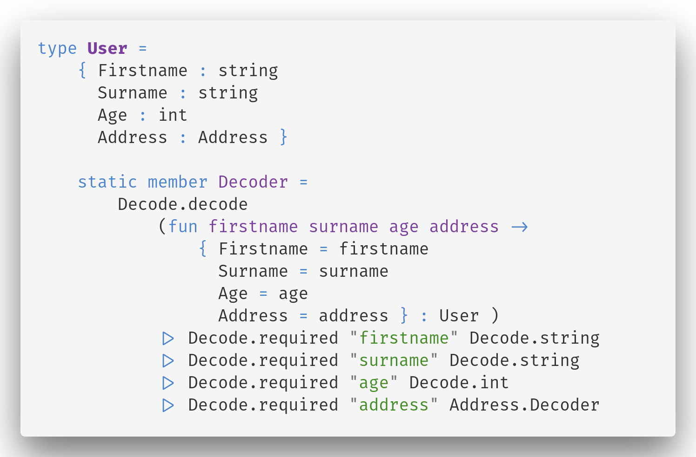

- title : F# and Fable
- description : Re-think web development
- author : Maxime Mangel
- theme : solarized
- transition : default

***

## F# and Fable

<br />

### Re-think web development

<br />
Maxime Mangel - [@MangelMaxime](http://www.twitter.com/MangelMaxime)

***

- Fable
- Elmish
- Tooling
- Elmish ecosystem
- Html to Elmish
- What's coming next ?

***

### Fable

- Compiler F# to JavaScript
- Readable output
- Best of .Net & JavaScript

---

### Fable

- No typos thanks to compiler
- Intellisense
- Error at design time

---

### Fable

## Demo

***

## The HTML problem

Demo by code

***

## Elmish

---

## Model - View - Update


---

---

## Model - View - Update

### Model

```fs
type Model =
    { Value : int }

type Msg =
    | Increment
    | Decrement

let init () =
    { Value = 0 }
```

---

## Model - View - Update

### Update

```fs
let update msg model =
    match msg with
    | Increment ->
        { model with Value = model.Value + 1 }

    | Decrement ->
        { model with Value = model.Value - 1 }
```

---

## Model - View - Update

### View

```fs
let view model dispatch =
    div [ ]
        [ button [ OnClick (fun _ -> dispatch Decrement) ]
            [ str "-" ]
          div [ ]
            [ str (string model.Value) ]
          button [ OnClick (fun _ -> dispatch Increment) ]
            [ str "+" ] ]
```

---

## Model - View - Update

### Linking everything

```fs
Program.mkSimple init update view
|> Program.withReact "elmish-app"
|> Program.run
```

---

## Model - View - Update

### Demo

***

### Nested components

### Model

```fs
type Model =
    { Counters : Counter.Model list }

type Msg =
    | Add
    | Remove
    | Modify of int * Counter.Msg

let init () = { Counters = [] }
```

---

## Nested components

### Update (1/2)

```fs
let update msg model =
    match msg with
    | Add ->
        { model with Counters = Counter.init () :: model.Counters }

    | Remove ->
        { model with
            Counters =
                match model.Counters with
                | [] -> []
                | _ :: tail -> tail }
```

---

## Nested components

### Update (2/2)

```fs
let update msg model =
    match msg with
    | Modify (counterIndex, counterMsg) ->
        { model with
            Counters =
                model.Counters
                |> List.mapi (fun localIndex counterModel ->
                    if localIndex = counterIndex then
                        Counter.update counterMsg counterModel
                    else
                        counterModel
                ) }
```

---

## Nested components

### View

```fs
let view model dispatch =
    let counterDispatch i msg = dispatch (Modify (i, msg))

    let counters =
        model.Counters
        |> List.mapi (fun i c -> Counter.view c (counterDispatch i))


    div [ ]
        [ yield button [ OnClick (fun _ -> dispatch Remove) ]
            [  str "Remove" ]
          yield button [ OnClick (fun _ -> dispatch Add) ]
            [ str "Add" ]
          yield! counters ]
```

---

## Model - View - Update

### Demo

***

### Tooling

---

## Elmish.Debugger


---

## Elmish.HMR


***

## The CSS problem

---

## Manual css with Bulma

```fs
let view model dispatch =
    div [ Class "columns is-vcentered"
          Style [ Width "300px" ] ]
        [ div [ Class "column" ]
            [ button [ Class "button"
                        OnClick (fun _ -> dispatch Decrement) ]
                [ str "-" ] ]
            div [ Class "column" ]
                [ str (string model.Value) ]
            div [ Class "column" ]
                [ button [ Class "button"
                           OnClick (fun _ -> dispatch Increment) ]
                [ str "+" ] ] ]
```

---

## Strongly typed css wtih Fulma

```fs
let view model dispatch =
    Columns.columns [ Columns.Props [ Style [ Width "300px" ] ]
                      Column.IsVcentered ]
        [ Column.column [ ]
            [ Button.button [ Button.OnClick (fun _ -> dispatch Decrement) ]
                [ str "-" ] ]
            Column.column [ ]
                [ str (string model.Value) ]
            Column.column [ ]
                [ Button.button [ Button.OnClick (fun _ -> dispatch Increment) ]
                    [ str "+" ] ] ]
```

***

## Time to code

***

## Thoth.Json

- No need to follow the json structure
- Decode only what's needed
- Strongly typed
- Easily extensible
- Nice error message

---

### Thot.Json.Decode



---

### Thot.Json.Decode


---

### Thot.Json.Decode


---

#### Thot.Json generator (WIP)


---

### Thot.Json-next

- Auto decoder/encoder using Reflection
- Better errors


***

## F# and Fable

### Summary

* No more HTML templates
* Views are just code
* Strongly typed CSS
* Strongly typed components
* Quick feedback
* Handle every case
* The compiler have your back

***

### Thank you!
